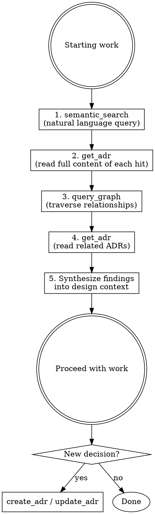

# Using the ADR Plugin (MCP)

## Overview

The obsidian-adr MCP server provides tools to search, read, create, merge, split, and manage Architecture Decision Records stored in the Obsidian vault. **Always consult existing ADRs before designing anything new** — past decisions contain critical context, constraints, and rationale that must inform current work.

All responses are TOON-encoded (Token-Oriented Object Notation) for minimal token usage. You can read TOON format natively.

## When to Use

**Before any design or implementation work:**
- Starting a new feature or module
- Changing architecture, dependencies, or conventions
- Making technology choices
- Debugging issues that might relate to past decisions

**After making decisions:**
- Record new architectural decisions as ADRs
- Update existing ADRs when decisions change
- Merge overlapping ADRs or split overly broad ones
- Add relationships between related ADRs

## Core Workflow



### Step 1: Semantic Search

Search for ADRs related to what you're about to work on. Use natural language — describe the domain, problem, or technology.

```
semantic_search({ query: "authentication and session management", project: "parai-core" })
semantic_search({ query: "frontend component library choices", project: "parai-core" })
```

Results include connections (supersedes, depends_on, relates_to) for each hit, so you can immediately see the relationship context without extra calls.

Run multiple searches with different angles if the topic is broad. For example, when working on a new API endpoint, search for "API design", "authentication", and the specific domain ("user profiles").

### Step 2: Read Full ADRs

`list_adrs` and `semantic_search` return summaries only (ID, title, status, date, connections). Read the full content of relevant hits:

```
get_adr({ adr_id: "ADR-012", project: "parai-core" })
```

The full content contains the rationale, context, consequences, and constraints that matter for your design.

### Step 3: Graph Traversal

For each relevant ADR, traverse its relationships to discover connected decisions:

```
query_graph({ adr_id: "ADR-012", project: "parai-core", depth: 2, direction: "both" })
```

This reveals ADRs that `depend_on`, `supersede`, or `relate_to` the one you found. These connected ADRs often contain constraints you wouldn't find via search alone.

For a quick connection check without graph traversal, use:

```
list_connections({ adr_id: "ADR-012", project: "parai-core" })
```

This returns both inbound and outbound connections for a single ADR.

### Step 4: Read Related ADRs

Read the full content of any related ADRs discovered through graph traversal that seem relevant to your work.

### Step 5: Synthesize

Combine all findings into design context before proceeding:
- What past decisions constrain the current design?
- What patterns and conventions are established?
- What was tried and rejected (and why)?
- Are any existing ADRs outdated and need updating?

## Recording New Decisions

When you make an architectural decision during implementation:

```
create_adr({
  project: "parai-core",
  title: "Descriptive title of the decision",
  status: "voorgesteld",
  domein: "Backend Core",
  tags: ["relevant", "tags"],
  depends_on: ["ADR-003"],
  relates_to: ["ADR-007"]
})
```

Then use `update_adr` to write the body with context, decision, and consequences.

**Always link new ADRs** to existing related ones using `depends_on`, `relates_to`, or `supersedes`.

### Domain Grouping (`domein`)

Every ADR should have a `domein` field for Dataview grouping in Obsidian. The ADR Index page uses Dataview queries to automatically group ADRs by domain. Use existing domain names when possible:

| Domain | Scope |
|--------|-------|
| Backend Core | Go services, module interfaces, config |
| Frontend & UI | Svelte, Tailwind, components |
| Auth & Beveiliging | Authentication, authorization, security |
| Database | SurrealDB, Neo4j, storage patterns |
| LLM Laag | LiteLLM, embeddings, streaming |
| Testing | E2E, integration, coverage |
| Quality & CI/CD | Linting, CI pipeline, code review |
| Infrastructuur | S3, event queues, SSE |
| Email | Templates, delivery, i18n |
| Dev Workflow | Build tags, file watchers, Docker dev |
| Internationalisatie | i18n, locale, Paraglide |
| Chat Module | RAG pipeline, DAG engine |

Create new domains sparingly — only when existing ones don't fit.

## Refactoring ADRs

### Merging Overlapping ADRs

When two or more ADRs cover the same ground or should be consolidated:

```
merge_adrs({
  project: "parai-core",
  source_ids: ["ADR-003", "ADR-007"],
  title: "Unified authentication strategy"
})
```

This creates a new ADR that:
- Combines the body content of all sources under section headers
- Unions all tags, depends_on, and relates_to relationships
- Sets `supersedes` to all source ADR IDs
- Marks all source ADRs as "vervangen" (superseded)

### Splitting Broad ADRs

When an ADR has grown too broad and covers multiple distinct decisions:

```
split_adr({
  project: "parai-core",
  adr_id: "ADR-005",
  new_adrs: [
    { title: "JWT token format and signing", content: "..." },
    { title: "Session expiry and refresh strategy", content: "..." }
  ]
})
```

This creates new ADRs that each `depends_on` the source, inheriting its tags. The source is marked as "vervangen" by default (set `retire_source: false` to keep it active).

## Connection Management

### Viewing Connections

See all relationships for an ADR (both directions):

```
list_connections({ adr_id: "ADR-012", project: "parai-core" })
```

Returns outbound connections (from frontmatter) and inbound connections (other ADRs pointing to this one).

### Bulk Editing Connections

Replace all connections of a specific type at once instead of adding/removing one by one:

```
set_connections({
  project: "parai-core",
  adr_id: "ADR-012",
  type: "relates_to",
  targets: ["ADR-003", "ADR-007", "ADR-015"]
})
```

This replaces the entire `relates_to` list for ADR-012. Use this for reorganizing relationships during cleanup.

### Single Connection Edits

For adding or removing individual connections:

```
add_relationship({ source_id: "ADR-012", target_id: "ADR-003", type: "depends_on", project: "parai-core" })
remove_relationship({ source_id: "ADR-012", target_id: "ADR-003", type: "depends_on", project: "parai-core" })
```

## Quick Reference

| Tool | Purpose | Returns |
|------|---------|---------|
| `list_projects` | Discover available projects | Project names and folders |
| `semantic_search` | Find ADRs by meaning | Ranked summaries with connections |
| `list_adrs` | Browse/filter ADRs | Summaries (no body) |
| `get_adr` | Read full ADR content | Complete ADR with body |
| `query_graph` | Traverse relationships | Nodes and edges |
| `list_connections` | All connections for an ADR | Inbound + outbound |
| `create_adr` | Record new decision | New ADR ID and path |
| `update_adr` | Modify title or content | Updated ADR |
| `update_status` | Change ADR status | Updated status |
| `add_relationship` | Link two ADRs | Confirmation |
| `remove_relationship` | Unlink two ADRs | Confirmation |
| `set_connections` | Bulk-replace connections of a type | Old + new targets |
| `merge_adrs` | Merge 2+ ADRs into one | New ADR ID, supersedes list |
| `split_adr` | Split ADR into multiple new ones | Created ADR IDs |

## Multi-Project

Multiple projects live under `Documentatie/*/ADR`. Pass `project` to scope tools:

```
list_adrs({ project: "Compote" })
list_adrs({ project: "parai-core" })
```

Cross-project references use `Project/ADR-NNN` syntax:

```
add_relationship({ source_id: "ADR-005", project: "Compote", target_id: "parai-core/ADR-003", type: "depends_on" })
```

## Common Mistakes

| Mistake | Fix |
|---------|-----|
| Skipping ADR check before design | Always search first — 2 minutes of research prevents contradicting past decisions |
| Reading only `list_adrs` summaries | Summaries lack rationale — always `get_adr` for full content |
| Searching once with one query | Search from multiple angles — technology, domain, pattern |
| Ignoring graph connections | `query_graph` reveals constraints you won't find via search |
| Creating isolated ADRs | Always add `depends_on` / `relates_to` links to keep the graph connected |
| Forgetting to record decisions | If you chose X over Y for architectural reasons, that's an ADR |
| Duplicating instead of merging | If two ADRs overlap, use `merge_adrs` instead of creating a third |
| Giant catch-all ADRs | If an ADR covers multiple distinct decisions, use `split_adr` |
| Missing `domein` field | Always set `domein` — the Dataview index groups by it |
