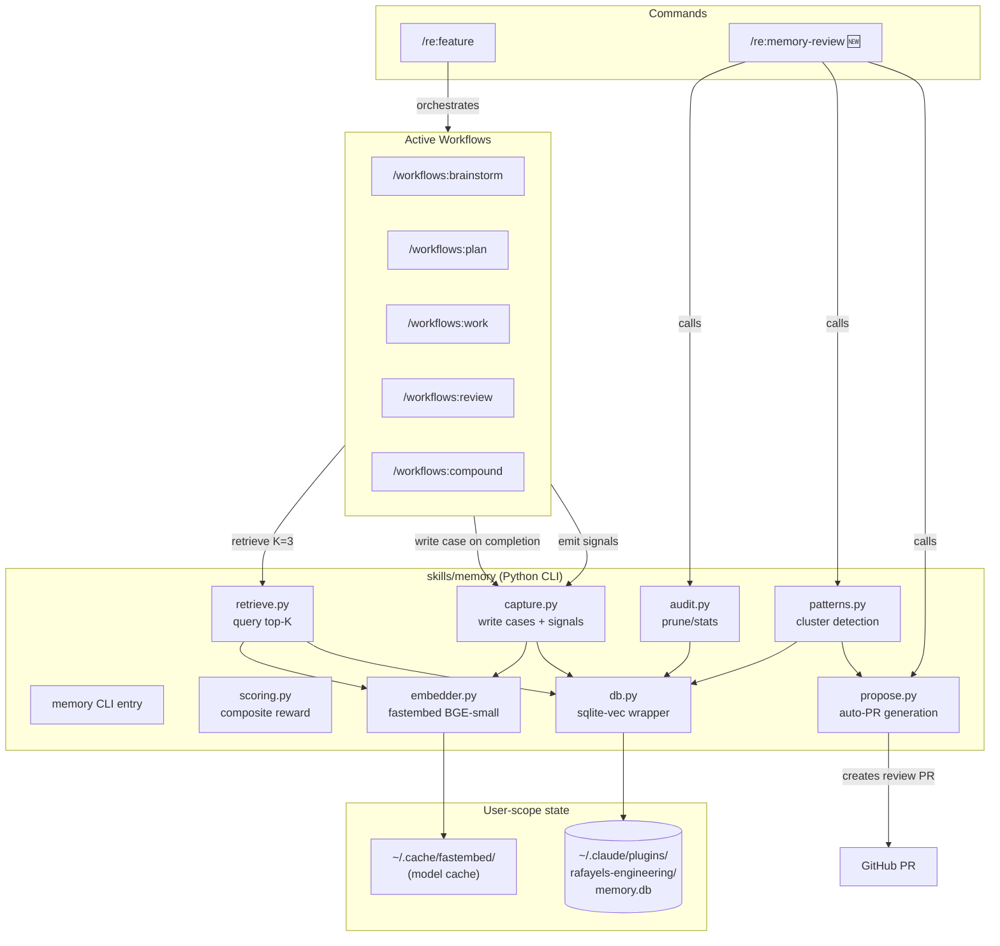

# Self-Improving Plugin: CBR-Based Memory Layer

## ⚠️ Technical Review Corrections (authoritative — supersedes older sections on conflict)

Technical review pass (2026-04-10) from 3 reviewers (rafayel-python-reviewer, architecture-strategist, code-simplicity-reviewer) flagged several corrections. These are the final, authoritative decisions. Where older sections of this plan conflict, these corrections win.

### ❌ CUT from v1 (simplification)

1. **Fastembed daemon (Unix socket, 200 LOC)** — accept per-invocation cold start. Per `/re:feature` run = 5 phase hooks × ~1s cold start = ~5s total overhead. Tolerable vs. the complexity of daemon + IPC + spawn race + PID lock. Replace with simple in-process `TextEmbedding` initialization in `embedder.py`. Revisit in v2 if metrics show pain.
2. **`memory-embedd.py` file** — gone with daemon cut.
3. **Full MMR implementation** — replace with 5-line cosine-floor greedy: `for each candidate, skip if max cosine-sim to any selected > 0.9`. Identical behavior at K=3. Keep MMR description in `references/injection-guide.md` as "upgrade path when K>5".
4. **Retrieval cap (`retrieval_cap_penalty`)** — keep `retrievals` table for debugging, but cut the penalty logic. Quarantine-on-write is sufficient defense for v1. Add cap in v2 if `memory report` shows a hot case dominating.
5. **Exponential reward decay** — redundant with the `prune` policy's 90-day hard cutoff. Use one decay mechanism, not two. Keep hard cutoff.
6. **Extra CRUD subcommands**: `read`, `list`, `update`, `delete`, `link`, `export`, `import`. v1 keeps only: `write`, `signal`, `query`, `report`, `prune`, `promote`, `seed`, `doctor`, `patterns detect`, `patterns propose`. Agents can read via `query` (with metadata in output). Add the others in v2 if needed.

### 🔧 Simplify

7. **File layout: 6 files, not 8 or 12**
   - `memory.py` — CLI entry (argparse dispatch)
   - `db.py` — connection, schema, migrations, PRAGMAs (not merged with embedder)
   - `embedder.py` — fastembed wrapper (in-process, no daemon)
   - `capture.py` — write_case, add_signal, composite_reward, prune, promote, seed
   - `retrieve.py` — query, cosine-floor greedy dedup, cold-start check
   - `patterns.py` — cluster detect, centroid match, PR propose (merged with propose.py)

   **Rationale**: Python reviewer was right that `core.py` mixed too many concerns (DB + embedder + bootstrap). Simplicity reviewer was right that 12 files is over-split. Compromise: 6 files with clean responsibilities. Bootstrap logic (~20 lines) lives inline in `memory.py` entry.

8. **Test files: 4 not 5 not 6**
   - `test_db.py` — schema, migrations, PRAGMAs, FK constraints
   - `test_capture.py` — write, signal, reward, quarantine promotion, prune
   - `test_retrieve.py` — phase filter, cosine-floor dedup, cold-start skip
   - `test_patterns.py` — clustering (with synthetic vectors), centroid matching, PR render (mocked gh)

   Plus `test_golden_replay.py` as integration test per architecture reviewer — seeded bank + frozen time + deterministic workflow transcript.

### 🐛 Bugs to fix

9. **`PRAGMA foreign_keys=ON`** missing from connection PRAGMAs. **SQLite defaults FKs OFF.** This is a real bug. Add to every connection.
10. **`ON DELETE CASCADE`** missing on `signals.case_id` and `retrievals.case_id` foreign keys. Without it, `memory delete <case_id>` leaves orphans.
11. **`sys.exit(0)` on dep missing is wrong** — workflows that pipe the output get empty stdout and proceed as if it succeeded. Use **exit code 75 (`os.EX_TEMPFAIL`)** and document workflow hooks to tolerate it as "memory unavailable, proceed without injection".
12. **Exception swallowing** — the graceful degradation flow catches bare `Exception` multiple times. Replace with specific exceptions: `ConnectionRefusedError`, `ImportError`, `sqlite3.OperationalError`, `subprocess.CalledProcessError`. Bare `except Exception` is allowed only at the outermost CLI boundary in `memory.py`, and must log traceback to stderr.
13. **`_detect_project` catches bare `Exception`** — use `subprocess.SubprocessError`, `OSError`, `FileNotFoundError` specifically.

### 🏛️ Architecture hardening

14. **Schema CHECK constraints** — enforce invariants in the database:
    ```sql
    CHECK(phase IN ('brainstorm','plan','work','review','compound'))
    CHECK(status IN ('quarantine','active','archived','promoted'))
    CHECK(reward >= 0.0 AND reward <= 1.0)
    CHECK(length(centroid) = 1536)  -- 384 floats × 4 bytes
    ```

15. **Quarantine-promotion trigger** — move the "2+ positive signals → active" logic into a SQL trigger, not Python convention:
    ```sql
    CREATE TRIGGER IF NOT EXISTS promote_on_positive_signals
    AFTER INSERT ON signals
    WHEN NEW.value > 0
    BEGIN
      UPDATE cases_raw
      SET status = 'active', updated = strftime('%s', 'now')
      WHERE case_id = NEW.case_id
        AND status = 'quarantine'
        AND (SELECT COUNT(*) FROM signals
             WHERE case_id = NEW.case_id AND value > 0) >= 2;
    END;
    ```

16. **`VectorIndex` protocol in `db.py`** — three methods only: `upsert(case_id, phase, vec)`, `search(vec, phase, k)`, `delete(case_id)`. Write vec0-backed impl behind this interface. Lets v2 swap to lance/chroma without rewriting `retrieve.py`.

17. **Typed `Config` dataclass** instead of stringly-typed `meta` KV:
    ```python
    @dataclass(frozen=True)
    class Config:
        schema_version: int
        embedding_model: str
        embedding_dim: int

        @classmethod
        def load(cls, db) -> "Config":
            rows = dict(db.execute("SELECT key, value FROM meta").fetchall())
            return cls(
                schema_version=int(rows["schema_version"]),
                embedding_model=rows["embedding_model"],
                embedding_dim=int(rows["embedding_dim"]),
            )
    ```
    Validated at startup. Catches mismatches before they become runtime errors.

18. **`Case` dataclass** — currently used in type hints but undefined. Add to `db.py`:
    ```python
    @dataclass(frozen=True)
    class Case:
        case_id: int
        phase: str
        case_type: str
        status: str
        reward: float
        title: str
        query: str
        plan: str
        outcome: str
        tags: list[str]
        injection_summary: str
        created: int
        updated: int
    ```

19. **Dependency injection for DB connection** — no module-level globals. Every function takes `conn: sqlite3.Connection` as first arg. CLI layer owns lifecycle.

20. **Pure-function cores for testability** — extract `composite_reward(signals: list[tuple[str, float]]) -> float` as pure function. Wrapper `composite_reward_for_case(conn, case_id)` does the fetch. Test the pure function with synthetic signals.

### 📦 Dependency fixes

21. **Pin fastembed exactly** — not unversioned. Inconsistent with the "pin sqlite-vec exactly" reasoning.
22. **Add to requirements.txt**: `pytest`, `pytest-mock`, `ruff` (dev deps, possibly split into `requirements-dev.txt`).
23. **pyyaml inconsistency** — listed in deps section but missing from requirements.txt list in Python file layout.
24. **Reconsider scipy** — 30MB for just `pdist`/`linkage`/`fcluster`. At N<2000, hand-roll UPGMA in ~50 lines of numpy. Or accept the hit and document it. Recommendation: hand-roll for v1, keep scipy off the dep list.

### 🧪 Additional acceptance criteria

25. **`mypy --strict`** as a quality gate (or at minimum `ruff check --select ANN` for type annotations). Type hints currently inconsistent in code sketches.
26. **Golden-bank replay test** (`tests/test_golden_replay.py`) — seeded case bank + frozen time + deterministic workflow transcript → assert retrieval returns expected IDs. Without this, retrieval regressions are invisible until production.
27. **Concurrency test** (`tests/test_concurrency.py`) — spawn two subprocess writes against same DB, verify no corruption. Validates the WAL + BEGIN IMMEDIATE claim.

### 🎯 All in v1 (user override: nothing deferred)

Per explicit user decision, these items are ALL in v1 scope. Reviving them from the "cut" list above:

- **Fastembed daemon** — RESTORED. Unix-socket daemon at `skills/memory/scripts/embed_daemon.py` (renamed from `memory-embedd.py` for Python-import safety). PID file + `fcntl.flock` for single-instance guard per architecture + Python reviewer feedback. 30min idle timeout. Fallback to in-process if daemon unreachable.
- **Separate `skills/memory-proposer/` skill** — RESTORED. Phase 5 (pattern detection + auto-PR generation) lives in its own skill to make the layering inversion architecturally visible. Depends on `memory` skill's CLI. Files: `skills/memory-proposer/SKILL.md`, `skills/memory-proposer/scripts/patterns.py`, `skills/memory-proposer/scripts/propose.py`, `skills/memory-proposer/scripts/memory_proposer.py` (CLI).
- **Full CRUD subcommands** — RESTORED. `read`, `list`, `update`, `delete`, `link`, `export`, `import` all in v1 memory CLI. Full agent-native parity.
- **Retrieval cap penalty** — RESTORED. `retrieval_cap_penalty()` applied at retrieval time. Ceiling 30% per case over 7-day lookback.
- **MMR reranking** — RESTORED (not 5-line greedy). Full MMR with λ=0.5 per research.
- **Exponential reward decay** — RESTORED. `exp(-age_days/60)` applied at retrieval time in addition to hard cutoff at 90d in prune policy. Both mechanisms active; decay demotes old cases during retrieval, prune archives them after 90d.

### Updated v1 File Layout (with user override)

Given "everything in v1", the file count increases again. Final structure:

```
skills/memory/                          # Core memory layer
├── SKILL.md                            # ~300 lines
├── scripts/
│   ├── memory.py                       # CLI entry (argparse dispatch)
│   ├── db.py                           # Connection, schema, migrations, VectorIndex protocol, Case/Config dataclasses
│   ├── embedder.py                     # fastembed wrapper + daemon client
│   ├── embed_daemon.py                 # Unix-socket daemon (renamed, no hyphens)
│   ├── capture.py                      # write, signal, reward (pure function), quarantine, prune, promote
│   ├── retrieve.py                     # query, MMR rerank, cold-start skip, cap penalty, decay
│   ├── audit.py                        # report, doctor, export, import
│   ├── seed.py                         # one-shot bootstrap from docs/solutions/
│   ├── migrations/
│   │   └── 001_initial.sql             # with CHECK constraints + quarantine trigger + FK CASCADE
│   ├── requirements.txt                # sqlite-vec==0.1.7, fastembed==X.Y.Z, numpy, tiktoken (optional)
│   ├── requirements-dev.txt            # pytest, pytest-mock, ruff, mypy
│   └── tests/
│       ├── test_db.py
│       ├── test_embedder.py
│       ├── test_embed_daemon.py
│       ├── test_capture.py
│       ├── test_retrieve.py
│       ├── test_audit.py
│       ├── test_concurrency.py         # cross-process DB test
│       └── test_golden_replay.py       # seeded bank + frozen time integration
└── references/
    ├── schema.md
    ├── signals.md
    ├── injection-guide.md
    └── case-format.md

skills/memory-proposer/                 # Phase 5: pattern detection + auto-PR
├── SKILL.md                            # Depends on memory skill
├── scripts/
│   ├── memory_proposer.py              # CLI entry
│   ├── patterns.py                     # clustering (hand-rolled UPGMA, no scipy)
│   ├── propose.py                      # git worktree + gh CLI PR generation
│   ├── requirements.txt                # numpy (+ memory skill as sibling dependency)
│   └── tests/
│       ├── test_patterns.py
│       └── test_propose.py
└── references/
    └── pr-template.md
```

All subcommands restored:
- `memory`: write, signal, query, read, list, update, delete, link, prune, promote, report, doctor, export, import, seed
- `memory-proposer`: detect, propose, list

---

## Enhancement Summary

**Deepened on:** 2026-04-10
**Research agents used:** 8 (sqlite-vec production, fastembed runtime, CBR retrieval strategies, cluster detection, gh auto-PR patterns, agent-native-architecture skill, create-agent-skills skill, Python simplicity review)

### Key Improvements from Research

1. **Fastembed daemon pattern** — cold start is 600ms-1.5s per invocation; calling fastembed on every workflow hook is unacceptable. Adding Unix-socket daemon (`memory-embedd`) with 30min idle timeout. Warm latency drops to ~10ms. Falls back to in-process one-shot if daemon unreachable.
2. **sqlite-vec `PARTITION KEY` on `phase`** — single biggest performance optimization. Pre-filters the index by phase before distance calculation. Critical for our K=3-per-phase retrieval pattern.
3. **Plain `cases_raw` table + vec0 index** — separates source-of-truth from vector index. Lets us re-embed on model upgrades without re-running inference on the original text.
4. **MMR retrieval diversity** — fetch top-10 by cosine, MMR-rerank to K=3 with λ=0.5. Prevents redundant near-duplicate cases from blowing the token budget.
5. **Cold-start handling** — retrieval is skipped entirely until ≥ K*3 cases exist per phase. Empty banks don't get queried.
6. **BGE distance threshold 0.15** — not 0.25 as originally planned. BGE-small cosine distances are compressed; 0.25 clusters topical blobs, not pattern clusters.
7. **Exponential reward decay** — `reward * exp(-age_days / 60)` at retrieval time. Older cases get less weight without being deleted.
8. **Poisoning defense (quarantine-on-write)** — new cases are quarantined until they accumulate N≥2 positive signals. Prevents a single bad case steering future retrievals.
9. **Per-case retrieval cap** — no case appears in more than X% of retrievals (enforced via retrieval-count penalty). Prevents one "sticky" case dominating.
10. **Auto-PR via git worktree + content-hash branch name** — idempotent, lock-free. Uses `gh pr list --head <branch>` for dedup. Always draft, triple-marker (draft + label + HTML body comment).
11. **Full CRUD CLI parity** — adding `read`, `list`, `update`, `delete`, `doctor` subcommands. Agent-native principle: every action a human can take via `/re:memory-review` can also be taken by an agent.
12. **Agent-pull over workflow-push** — workflow hooks inject a minimal starter case, but SKILL.md documents the CLI as directly agent-callable so agents can query memory mid-workflow for follow-up questions.
13. **File consolidation** — merged `db.py`, `embedder.py`, `bootstrap.py` into single `core.py`. Merged `scoring.py` into `capture.py`. Reduces file count from 12 to ~7 without losing separation of concerns.
14. **Pin `sqlite-vec==0.1.7` exactly** — not `0.1.*`. Every 0.1.x alpha has had shadow-table layout changes.
15. **Cluster threshold 0.15, UPGMA** — `method="average"` for cosine distance (ward requires Euclidean). `min_cluster_size = max(5, int(0.01 * N))` scales with bank size.
16. **Centroid-based pattern stability** — don't persist cluster IDs. Persist centroid + representative case IDs. Match across runs by centroid cosine similarity (threshold 0.10) so pattern identity survives re-clustering.

### New Considerations Discovered

- **~250-400MB RSS per loaded model** — concurrent workflows multiply. Daemon approach keeps this to a single process.
- **sqlite-vec `vec0` cannot be ALTERed** — all schema changes require drop + rebuild from `cases_raw` plain table.
- **Negative cases need different injection format** — positives are templates to imitate, negatives are short anti-pattern warnings.
- **Query embedding should be cached per workflow_run_id** — we query multiple times in one `/re:feature` run with similar contexts; caching saves 20-50ms per phase.
- **Conflict noted**: simplicity reviewer recommended cutting Phase 5 entirely. User explicitly kept it in v1. Resolution: keep Phase 5 but mark its scripts as `v1-deferred-acceptable` — core feature (Phases 1-4) can ship without Phase 5 if time pressures.

## Overview

Add a **case-based reasoning memory layer** to the rafayels-engineering plugin. The plugin captures feedback signals from every `/re:feature` run, stores them as cases in a local vector database (`sqlite-vec` + `fastembed`), and injects the most relevant past cases into active agents at runtime. Over time, the plugin gets better at planning, reviewing, and implementing features — without ever editing its own agent or skill files.

**Core architectural constraint:** Agents and skills stay frozen. All improvement flows through retrieval, not self-editing. Pattern detection generates review-able PRs for skill updates — the plugin never writes to `agents/` or `skills/` autonomously.

## Problem Statement

The plugin currently has zero memory between sessions. Every `/re:feature` run starts cold. The `compound-docs` skill captures solved problems as markdown, but:
- Nothing tells us which documented solutions actually worked when retrieved later
- There's no vector-based semantic retrieval — only keyword grep
- Cases aren't injected into active workflows at runtime, only referenced by the `learnings-researcher` agent on explicit request
- No feedback signal loop — we can't tell successful cases from failed ones
- Learnings don't compound across projects (everything is project-scoped)

Memento (arXiv 2508.16153) proved that case-based reasoning with retrieval beats prompt rewriting for continual agent improvement (87.9% on GAIA). We want that benefit without the risks of self-editing agent prompts.

## Proposed Solution

A new `skills/memory/` Python-based skill that provides a CLI (`memory`) for five operations:

1. **`memory write`** — Capture a case (query + plan + trajectory + outcome)
2. **`memory signal`** — Append a signal to an existing case (merge, CI, approval, review, regression)
3. **`memory query`** — Retrieve top-K relevant cases for a phase
4. **`memory report`** — Audit statistics, prune candidates, staleness
5. **`memory patterns`** — Detect emerging patterns across cases, propose skill updates as PR

Hooks are added to every workflow command (`brainstorm`, `plan`, `work`, `review`, `compound`) to:
- **Retrieve** relevant cases at the start of each phase (K=3 per phase, 300-token cap per case)
- **Capture** a case on phase completion
- **Signal** outcomes at each phase transition

A new `/re:memory-review` command provides manual audit, pruning, and pattern inspection.

## Technical Approach

### Architecture



### Database Schema

**Architecture pattern:** Separate the source-of-truth (`cases_raw` plain table) from the vector index (`cases_vec` sqlite-vec virtual table). This lets us re-embed on model upgrades without re-running inference on the original text, and sidesteps sqlite-vec's inability to `ALTER` virtual tables.

Five tables in `memory.db`:

```sql
-- 0. Metadata (schema version, embedding model name, settings)
CREATE TABLE IF NOT EXISTS meta (
  key TEXT PRIMARY KEY,
  value TEXT NOT NULL
);
-- Seeded with: schema_version=1, embedding_model=BAAI/bge-small-en-v1.5, embedding_dim=384

-- 1. Source of truth: plain table with full case data
CREATE TABLE IF NOT EXISTS cases_raw (
  case_id INTEGER PRIMARY KEY AUTOINCREMENT,
  phase TEXT NOT NULL,           -- brainstorm | plan | work | review | compound
  case_type TEXT,                -- bug | pattern | decision | solution
  status TEXT DEFAULT 'quarantine', -- quarantine | active | archived | promoted
  reward REAL DEFAULT 0.5,       -- composite (recomputed on signal insert)
  created INTEGER NOT NULL,
  updated INTEGER NOT NULL,
  project TEXT,                  -- repo basename (auto-detected via git)
  title TEXT,
  query TEXT NOT NULL,           -- embedded text (query + plan joined)
  plan TEXT,
  trajectory TEXT,               -- JSON
  outcome TEXT,
  tags TEXT,                     -- JSON array
  injection_summary TEXT         -- ~300-word pre-capped summary for LLM context
);
CREATE INDEX idx_cases_phase ON cases_raw(phase);
CREATE INDEX idx_cases_status ON cases_raw(status);
CREATE INDEX idx_cases_reward ON cases_raw(reward);
CREATE INDEX idx_cases_project ON cases_raw(project);

-- 2. Vector index (sqlite-vec vec0 virtual table)
-- KEY OPTIMIZATION: phase as PARTITION KEY — pre-filters before distance calc
CREATE VIRTUAL TABLE IF NOT EXISTS cases_vec USING vec0(
  case_id INTEGER PRIMARY KEY,
  phase TEXT PARTITION KEY,      -- Pre-filter index by phase (5 partitions ~ 2k each at 10k total)
  embedding float[384] distance_metric=cosine
);
-- No auxiliary columns here — aux data lives in cases_raw

-- 3. Signals ledger (append-only)
CREATE TABLE IF NOT EXISTS signals (
  signal_id INTEGER PRIMARY KEY AUTOINCREMENT,
  case_id INTEGER NOT NULL,
  signal_type TEXT NOT NULL,     -- merge | ci | approval | review | regression
  value REAL NOT NULL,            -- -1.0 to 1.0
  source TEXT,                    -- "pr:#123" | "phase:plan" | "user"
  created INTEGER NOT NULL,
  metadata TEXT,                  -- JSON
  FOREIGN KEY (case_id) REFERENCES cases_raw(case_id)
);
CREATE INDEX idx_signals_case ON signals(case_id);
CREATE INDEX idx_signals_type ON signals(signal_type);

-- 4. Retrieval log (for cap-per-case poisoning defense + debugging)
CREATE TABLE IF NOT EXISTS retrievals (
  retrieval_id INTEGER PRIMARY KEY AUTOINCREMENT,
  case_id INTEGER NOT NULL,
  phase TEXT NOT NULL,
  workflow_run_id TEXT,
  distance REAL,
  rank INTEGER,                   -- position in retrieved list (1..K)
  created INTEGER NOT NULL,
  FOREIGN KEY (case_id) REFERENCES cases_raw(case_id)
);
CREATE INDEX idx_retrievals_case ON retrievals(case_id);
CREATE INDEX idx_retrievals_run ON retrievals(workflow_run_id);

-- 5. Pattern state (Phase 5)
CREATE TABLE IF NOT EXISTS patterns (
  pattern_id INTEGER PRIMARY KEY AUTOINCREMENT,
  centroid BLOB NOT NULL,         -- packed float32[384] for stability matching
  case_ids TEXT NOT NULL,         -- JSON array of representative case_ids
  case_count INTEGER,
  avg_reward REAL,
  summary TEXT,
  pr_url TEXT,
  pr_branch TEXT,
  status TEXT DEFAULT 'detected', -- detected | proposed | merged | ignored
  created INTEGER,
  updated INTEGER
);
CREATE INDEX idx_patterns_status ON patterns(status);
```

**Required PRAGMAs** (set on every connection):

```sql
PRAGMA journal_mode=WAL;
PRAGMA synchronous=NORMAL;
PRAGMA busy_timeout=30000;          -- 30s retry on SQLITE_BUSY
PRAGMA wal_autocheckpoint=1000;
PRAGMA temp_store=MEMORY;
PRAGMA mmap_size=268435456;         -- 256 MB (helps vec0 shadow tables)
PRAGMA cache_size=-65536;           -- 64 MB page cache
```

**Write pattern** (from research — critical for concurrent workflows):

```python
# Always use BEGIN IMMEDIATE for writes — avoids deferred → upgrade deadlock
db.execute("BEGIN IMMEDIATE")
try:
    db.execute("INSERT INTO cases_raw (...) VALUES (...)", ...)
    db.execute("INSERT INTO cases_vec (case_id, phase, embedding) VALUES (?, ?, ?)", ...)
    db.execute("COMMIT")
except sqlite3.OperationalError:
    db.execute("ROLLBACK")
    raise  # Retry wrapper handles SQLITE_BUSY
```

### Fastembed Daemon Architecture (NEW from research)

Calling fastembed on every workflow hook is prohibitive: cold start is 600ms-1.5s per invocation. Solution: Unix-socket daemon.

```
┌─────────────────────────────────┐
│  memory CLI (one-shot)          │
│  - spawns daemon if not running │
│  - connects to socket           │
│  - sends JSON request           │
│  - receives embeddings          │
│  - exits                        │
└─────────────────────────────────┘
         │ Unix socket
         ▼
┌─────────────────────────────────┐
│  memory-embedd (persistent)     │
│  - fastembed loaded (~300MB)    │
│  - listens on $XDG_RUNTIME_DIR  │
│    /rafayels-memory-embedd.sock │
│  - 30 min idle timeout          │
│  - auto-exits on timeout        │
└─────────────────────────────────┘
```

**Protocol** (JSON over Unix socket, line-delimited):
- Request: `{"action": "embed", "texts": ["foo", "bar"]}`
- Response: `{"embeddings": [[...], [...]], "model": "BAAI/bge-small-en-v1.5", "dim": 384}`
- Health check: `{"action": "ping"}` → `{"status": "ok", "uptime_seconds": 123}`
- Shutdown: `{"action": "stop"}` → daemon exits after current request

**Fallback**: If daemon connect fails (socket missing, daemon crashed), fall back to in-process one-shot embedding. The CLI still works, just slower. Print a warning to stderr but don't error.

**Warm latency**: ~10ms per query (vs ~1s cold). Trade-off: persistent ~300MB RSS while daemon is alive.

**Auto-spawn**: `memory query` checks for socket, if missing runs `nohup python3 memory-embedd.py &` and waits up to 3s for socket to appear before falling back to in-process.

### Composite Reward Formula

```python
# capture.py (merged from scoring.py)
WEIGHTS = {
    "merge": 0.40,       # PR merged AND CI passed → +1.0; merged but CI fail → 0.5; never merged → 0.0
    "approval": 0.30,    # explicit user approval at phase handoffs (1.0 per approval, averaged)
    "review": 0.20,      # review findings severity: no P1 → 1.0, P1 → -1.0, P2 → -0.3, P3 → 0.0
    "regression": 0.10,  # -1.0 if file touched by case was reverted OR new bug-track entry within 30 days
}

def composite_reward(case_id: int) -> float:
    """Weighted mean of signal values, mapped to [0.0, 1.0]. 0.5 is neutral (no signals)."""
    rows = db.execute(
        "SELECT signal_type, value FROM signals WHERE case_id = ?", (case_id,)
    ).fetchall()
    if not rows:
        return 0.5  # Neutral — new cases with no signals yet
    by_type = defaultdict(list)
    for sig_type, value in rows:
        by_type[sig_type].append(value)
    score = 0.0
    weight_sum = 0.0
    for sig_type, weight in WEIGHTS.items():
        if sig_type in by_type:
            score += weight * (sum(by_type[sig_type]) / len(by_type[sig_type]))
            weight_sum += weight
    # Normalize to used weights (don't penalize cases with only partial signals)
    if weight_sum > 0:
        score = score / weight_sum
    return max(0.0, min(1.0, (score + 1.0) / 2.0))  # map [-1,1] → [0,1]


def apply_reward_decay(reward: float, age_days: int, tau: float = 60.0) -> float:
    """Exponential decay: newer cases trusted more. Half-life ~42 days at tau=60."""
    import math
    return reward * math.exp(-age_days / tau)
```

**Logging decision**: always log individual signal values separately in the `signals` table (not just the composite). This lets us re-fit weights later via logistic regression once we have ~200+ labeled cases, without re-running the pipeline.

### Retrieval Strategy: MMR + Cold Start + Poisoning Defense

Research identified three critical retrieval concerns beyond simple top-K.

**1. MMR (Maximal Marginal Relevance) reranking** — prevents K=3 results from being near-duplicates:

```python
# retrieve.py
def mmr_rerank(
    query_vec: np.ndarray,
    candidates: list[tuple[int, np.ndarray, float]],  # (case_id, embedding, distance)
    k: int = 3,
    lambda_: float = 0.5,
) -> list[int]:
    """Maximal Marginal Relevance rerank: balance relevance (λ) vs diversity (1-λ)."""
    if len(candidates) <= k:
        return [c[0] for c in candidates]
    selected = []
    remaining = list(candidates)
    while len(selected) < k and remaining:
        best_score = -float("inf")
        best_idx = 0
        for i, (cid, vec, dist) in enumerate(remaining):
            relevance = 1.0 - dist  # distance → similarity
            if not selected:
                diversity_penalty = 0.0
            else:
                max_sim_to_selected = max(
                    float(np.dot(vec, s[1])) for s in selected
                )
                diversity_penalty = max_sim_to_selected
            mmr_score = lambda_ * relevance - (1 - lambda_) * diversity_penalty
            if mmr_score > best_score:
                best_score = mmr_score
                best_idx = i
        selected.append(remaining.pop(best_idx))
    return [s[0] for s in selected]
```

**Flow**: sqlite-vec returns top-10 candidates → MMR rerank → final K=3. The 10→3 funnel happens in Python, which is fast for small N.

**2. Cold-start handling** — skip retrieval entirely when bank is too sparse:

```python
def should_retrieve(phase: str, k: int = 3) -> bool:
    """Return False if bank has fewer than k*3 cases for this phase."""
    count = db.execute(
        "SELECT COUNT(*) FROM cases_raw WHERE phase = ? AND status = 'active'",
        (phase,),
    ).fetchone()[0]
    return count >= k * 3
```

Workflows check `should_retrieve()` before calling `memory query`. If False, phase proceeds without injection. Prevents polluting context with noise from a near-empty bank.

**3. Poisoning defense — quarantine-on-write + retrieval cap**:

```python
# New cases start in status='quarantine' — not retrievable
def write_case(...) -> int:
    case_id = insert_case(..., status='quarantine')
    ...
    return case_id

# Promoted to 'active' only after 2+ positive signals
def on_signal_insert(case_id: int, signal_value: float):
    if signal_value > 0:
        positive_count = db.execute(
            "SELECT COUNT(*) FROM signals WHERE case_id = ? AND value > 0",
            (case_id,),
        ).fetchone()[0]
        if positive_count >= 2:
            db.execute(
                "UPDATE cases_raw SET status = 'active' WHERE case_id = ? AND status = 'quarantine'",
                (case_id,),
            )

# Cap retrieval frequency: no single case in more than 30% of recent retrievals
def retrieval_cap_penalty(case_id: int, lookback_days: int = 7) -> float:
    """Return a penalty in [0,1] proportional to how over-retrieved this case is."""
    since = int(time.time()) - (lookback_days * 86400)
    total = db.execute("SELECT COUNT(*) FROM retrievals WHERE created >= ?", (since,)).fetchone()[0]
    if total < 10:
        return 0.0  # not enough data
    this_case = db.execute(
        "SELECT COUNT(*) FROM retrievals WHERE case_id = ? AND created >= ?",
        (case_id, since),
    ).fetchone()[0]
    ratio = this_case / total
    if ratio > 0.3:
        return (ratio - 0.3) * 2.0  # max penalty 1.4 at 100% dominance
    return 0.0
```

The retrieval cap is applied as a final score adjustment: `final_score = (1 - distance) * (1 - penalty)`. Over-retrieved cases get demoted, letting fresher cases surface.

### Python CLI Design

The `memory` CLI is a single entry point with subcommands. **Agent-native principle**: every action a human can take via `/re:memory-review` can also be taken directly by an agent via this CLI. All subcommands support `--json` for parseable output.

**Full CRUD + operations:**

```bash
# ─── Create ─────────────────────────────────────────────
memory write \
  --phase plan \
  --type decision \
  --title "Chose rsync over git subtree for marketplace sync" \
  --query "How to sync plugin files to marketplace repo?" \
  --plan "Use rsync -a --delete to mirror dev repo contents" \
  --trajectory "ran rsync, committed, pushed" \
  --outcome "Clean sync, no conflicts" \
  --tags '["marketplace","sync"]' \
  --json   # returns {"case_id": 42, "status": "quarantine"}

memory seed --from docs/solutions/  # one-shot bootstrap from existing markdown

# ─── Read ───────────────────────────────────────────────
memory read <case_id> --json              # single case by ID
memory list --phase plan --status active --limit 20 --json  # filtered list
memory query "setting up marketplace sync" --phase plan --k 3 --format json
memory query "..." --phase plan --k 5 --with-negatives --json  # include failed cases

# ─── Update ─────────────────────────────────────────────
memory update <case_id> --title "..." --tags '["new","tags"]' --json
memory signal <case_id> merge 1.0 --source "pr:#1" --json
memory signal <case_id> review -0.3 --source "p2-finding" --json
memory promote <case_id> --json           # pin as critical (immune to prune)
memory link <case_id1> <case_id2> --json  # mark two cases as related

# ─── Delete ─────────────────────────────────────────────
memory delete <case_id> --confirm-token <token> --json  # hard delete
memory prune --dry-run --reward-below 0.3 --older-than 90 --json  # policy-based
memory prune --confirm --reward-below 0.3 --older-than 90         # actual delete

# ─── Audit ──────────────────────────────────────────────
memory report --stats --json
memory report --stale --older-than 90 --json
memory doctor --json                      # self-diagnose (DB missing, model mismatch, etc.)
memory export --format jsonl > backup.jsonl  # full export
memory import backup.jsonl                   # restore

# ─── Patterns (Phase 5) ─────────────────────────────────
memory patterns detect --min-cluster 5 --threshold 0.15 --json
memory patterns propose <pattern_id> --target-skill github --json
memory patterns list --status detected --json
```

**Design principles (from agent-native research):**

1. **`--json` on every subcommand** — structured output for agent parsing. Stdout is pure JSON (logs and errors go to stderr).
2. **Exit codes**: 0 success, 1 not-found, 2 validation error, 3 storage error, 4 deps missing.
3. **No interactive prompts** — `prune` requires `--confirm` flag, `delete` requires `--confirm-token` (obtained from a preview call). Interactive flow lives in `/re:memory-review` command markdown, not the CLI.
4. **Composability** — outputs are pipeable: `memory list --status active --json | jq '.[].case_id' | xargs -I{} memory read {}`.
5. **Stable schemas** — documented in `skills/memory/references/schema.md`, versioned via `meta.schema_version`.
6. **`memory doctor`** — self-diagnose command for agents to check whether memory is usable: DB exists, schema up to date, embedder daemon reachable, model cache valid.
7. **Dry-run default for destructive ops** — `prune` is dry-run unless `--confirm` is passed. Delete requires a two-step token flow.

### Python File Layout (consolidated from research)

```
skills/memory/
├── SKILL.md                    # Skill metadata + usage guide (~250 lines, with examples)
├── scripts/
│   ├── memory.py               # CLI entry point (argparse dispatch, ~300 lines)
│   ├── core.py                 # DB connect, schema, migrations, fastembed wrapper, bootstrap (~400 lines)
│   │                           #   (merged from db.py + embedder.py + bootstrap.py)
│   ├── capture.py              # write_case(), add_signal(), composite_reward() (~250 lines)
│   │                           #   (merged with scoring.py)
│   ├── retrieve.py             # query(), MMR rerank, cold-start check, cap penalty (~300 lines)
│   ├── audit.py                # report(), prune(), promote(), doctor() (~200 lines)
│   ├── patterns.py             # scipy-based agglomerative clustering + centroid matching (~200 lines)
│   ├── propose.py              # git worktree + gh CLI PR generation (~250 lines)
│   ├── memory-embedd.py        # Unix-socket fastembed daemon (~200 lines) 🆕
│   ├── migrations/
│   │   └── 001_initial.sql
│   ├── requirements.txt        # sqlite-vec==0.1.7, fastembed, numpy, scipy, tiktoken (optional)
│   └── tests/
│       ├── test_core.py        # DB schema, fastembed init, graceful degrade
│       ├── test_capture.py     # write, signal, reward recompute, quarantine promotion
│       ├── test_retrieve.py    # phase filter, MMR, cold start, cap penalty
│       ├── test_patterns.py    # clustering + centroid matching
│       └── test_propose.py     # PR generation (mocked gh CLI)
└── references/
    ├── schema.md               # DB schema reference
    ├── signals.md              # Signal types, weights, formulas, decay
    ├── injection-guide.md      # Workflow hook contract + agent-callable pattern
    └── case-format.md          # Case structure, 300-token budget, injection templates (positive vs negative)
```

**Consolidation rationale**: Merged 12 files → 8 based on the simplicity review while preserving the separation of concerns needed for Phase 5 (user explicitly kept auto-PR in v1). `core.py` bundles low-level infrastructure (DB + embedder + deps). `capture.py` bundles write-path logic. This keeps each module around 200-400 lines — readable but not padded.

### Integration with Workflows

Workflow files are markdown **instruction files** (Claude reads them and executes tools via Bash). Hooks are written as Claude-readable instructions, not bash scripts.

**CLI path resolution:** The `memory` CLI lives at `${CLAUDE_PLUGIN_ROOT}/skills/memory/scripts/memory.py`. All workflow hooks invoke it via:

```
python3 ${CLAUDE_PLUGIN_ROOT}/skills/memory/scripts/memory.py <subcommand> [args]
```

To reduce noise, `bootstrap.py` creates a shell alias `memory=python3 .../memory.py` on first CLI use, written to the DB metadata. Workflow hook examples below use the short `memory` form for readability — the literal invocation is the full path.

**Hook 1: Retrieval** (at start of phase body)

```markdown
### Phase X.0: Retrieve Relevant Cases

Before running phase work, query the memory layer via Bash:

  memory query "<feature description>" --phase <phase_name> --k 3 --format md

- If the command returns cases (exit 0 with stdout), include the output in the phase context before proceeding.
- If the command fails or exits silently (deps missing, DB locked, empty bank), continue without memory injection — do not error.
- Store the workflow_run_id returned in the JSON header for cross-phase dedup.
```

**Hook 2: Case Capture** (at end of phase body)

```markdown
### Phase X.9: Capture Case

After phase completes, write a case summary via Bash:

  memory write --phase <phase_name> --type <case_type> \
    --title "<short human title>" \
    --query "<feature description>" \
    --plan "<approach summary>" \
    --trajectory "<key actions as JSON>" \
    --outcome "<outcome summary>" \
    --tags "<tags as JSON array>"

The command prints the created case_id to stdout. Capture it in the phase state so subsequent hooks can emit signals against this case.
```

**Hook 3: Signal Emission** (at phase transition or specific events)

```markdown
After a phase handoff is approved, or after a specific outcome is observed, emit a signal via Bash:

  memory signal <case_id> approval 1.0 --source "phase:<phase_name>"
  memory signal <case_id> review -0.3 --source "p2-finding"
  memory signal <case_id> regression -1.0 --source "file-reverted"

Signal values are floats in [-1.0, 1.0]. Only emit signals when the outcome is unambiguous — uncertain outcomes should skip the signal entirely rather than guess.
```

### Project Detection

The `project` column is populated automatically by `capture.py` on every `write_case()` call:

```python
# capture.py
def _detect_project(cwd: Path) -> str:
    """Return repo name from git, or 'unknown' if not in a git repo."""
    try:
        result = subprocess.run(
            ["git", "-C", str(cwd), "rev-parse", "--show-toplevel"],
            capture_output=True, text=True, timeout=2
        )
        if result.returncode == 0:
            return Path(result.stdout.strip()).name
    except Exception:
        pass
    return "unknown"
```

No user action needed — project detection is automatic per invocation.

### Token Budget Enforcement

The 300-token cap on `injection_summary` is enforced at **write time** using tiktoken (for accuracy) with a word-count fallback:

```python
# capture.py
def _enforce_token_cap(text: str, max_tokens: int = 300) -> str:
    """Truncate text to max_tokens tokens, preferring sentence boundaries."""
    try:
        import tiktoken
        enc = tiktoken.get_encoding("cl100k_base")  # GPT-4 tokenizer, close enough for Claude
        tokens = enc.encode(text)
        if len(tokens) <= max_tokens:
            return text
        truncated = enc.decode(tokens[:max_tokens])
        # Back up to last sentence boundary
        for punct in [". ", "! ", "? ", "\n\n"]:
            idx = truncated.rfind(punct)
            if idx > len(truncated) * 0.7:
                return truncated[: idx + len(punct)].rstrip()
        return truncated + "…"
    except ImportError:
        # Fallback: word-count estimate (1 word ≈ 1.3 tokens)
        words = text.split()
        max_words = int(max_tokens / 1.3)
        if len(words) <= max_words:
            return text
        return " ".join(words[:max_words]) + "…"
```

`tiktoken` is added to `requirements.txt` as optional — if missing, the word-count fallback is used. This keeps the cap loose but predictable.

### Workflow-by-Workflow Integration

| Workflow | Hook 1: Retrieve | Hook 2: Capture | Hook 3: Signals |
|----------|------------------|-----------------|-----------------|
| `/workflows:brainstorm` | Phase 1.0 before research | Phase 3.5 after review | approval (on handoff), regression (on follow-up) |
| `/workflows:plan` | Step 0.5 before research | Post-creation after mandatory review | approval, review (from document-review) |
| `/workflows:work` | Phase 1.0 before task loop | Phase 4 after PR push | merge, ci, review (from review workflow) |
| `/workflows:review` | Step 0.7 before agent dispatch | After all findings collected | review (severity-based) |
| `/workflows:compound` | Phase 0.5 before solution research | Phase 3 after solution doc | approval (if promoted to critical-patterns) |

### Agent-Pull Pattern (NEW from research)

In addition to workflow-push hooks (which inject a starter set of cases at phase boundaries), the memory CLI is documented as **agent-callable**. Any agent running inside a workflow phase can query memory mid-execution:

> "You have the memory CLI available at `${CLAUDE_PLUGIN_ROOT}/skills/memory/scripts/memory.py`. If you encounter a problem or decision point during this phase, you can query past cases directly: `memory query '<your question>' --phase <current_phase> --k 3 --json`. This supplements the starter cases injected at phase start."

This hybrid push-pull model gives:
- **Push at phase boundaries** — cheap, deterministic, minimum context injection
- **Pull on demand mid-phase** — emergent capability, agents explore memory as questions arise
- **No duplicate retrieval** — cross-phase dedup via `workflow_run_id` prevents the same case appearing twice

Document this pattern explicitly in `skills/memory/references/injection-guide.md` and `skills/memory/SKILL.md`.

## Implementation Phases

### Phase 1: Core Infrastructure (Foundation)

**Goal:** Working CLI with DB, embedder daemon, and basic write/query. Testable in isolation.

**Files created:**
- `skills/memory/SKILL.md` (~250 lines, frontmatter below)
- `skills/memory/scripts/memory.py` (CLI dispatch)
- `skills/memory/scripts/core.py` (DB + fastembed wrapper + bootstrap, merged)
- `skills/memory/scripts/memory-embedd.py` (Unix-socket daemon)
- `skills/memory/scripts/migrations/001_initial.sql`
- `skills/memory/scripts/requirements.txt`
- `skills/memory/scripts/tests/test_core.py`

**SKILL.md frontmatter** (per create-agent-skills research):
```yaml
---
name: memory
description: "Persistent cross-session memory store with case-based retrieval. Records, retrieves, and injects successful patterns, failed attempts, user corrections, and past decisions via a local sqlite-vec database. Use when the user asks to remember something, recall prior context, review the case bank, or when running /re:feature workflows that benefit from learned patterns."
allowed-tools: Bash(python3 *:memory*), Bash(git *), Read, Write, Edit, Grep
---
```

**NOT** `disable-model-invocation` — memory is exactly the kind of ambient skill that should auto-trigger on phrases like "remember that we decided X" or "what did we do last time for Y".

**Key decisions in this phase:**
- **User-scope DB path**: `~/.claude/plugins/rafayels-engineering/memory.db`
- **Model cache**: `~/.cache/rafayels-memory/fastembed/` (NOT default temp dir — that's ephemeral on macOS)
- **Dependency strategy**: Check at CLI entry via `core.check_deps()`. On failure, print helpful `pip install` message to stderr, `sys.exit(0)` (not 1) — workflows should proceed without memory, not crash.
- **Pin `sqlite-vec==0.1.7`** exactly. Every 0.1.x alpha has had shadow-table layout changes.
- **Pin SQLite runtime check**: assert `sqlite3.sqlite_version_info >= (3, 41, 0)` at startup.
- **PRAGMAs on connect**: WAL + busy_timeout=30000 + BEGIN IMMEDIATE for writes.
- **Daemon auto-spawn**: `memory query` checks for Unix socket; if missing, `nohup python3 memory-embedd.py &` and wait up to 3s for socket to appear. Fall back to in-process embedding if timeout.

**Graceful degradation flow** (from fastembed research):
```python
# core.py
def get_embedder_for_query(texts: list[str]) -> list[np.ndarray] | None:
    """Try daemon first, fall back to in-process, return None if both fail."""
    try:
        return _query_daemon(texts)
    except (ConnectionRefusedError, FileNotFoundError, TimeoutError):
        pass  # daemon unreachable
    try:
        _spawn_daemon()
        time.sleep(1.5)
        return _query_daemon(texts)
    except Exception:
        pass
    try:
        # Fallback: in-process one-shot
        from fastembed import TextEmbedding
        embedder = TextEmbedding(
            model_name="BAAI/bge-small-en-v1.5",
            cache_dir=str(Path.home() / ".cache" / "rafayels-memory" / "fastembed"),
            threads=1,
        )
        return list(embedder.embed(texts))
    except ImportError:
        sys.stderr.write(
            "[memory] fastembed not installed. "
            "Install with: pip install -r skills/memory/scripts/requirements.txt\n"
        )
        return None  # Caller falls back to no-memory mode
    except Exception as e:
        sys.stderr.write(f"[memory] Embedder failed: {e}\n")
        return None
```

**Acceptance:**
- `memory --help` works and prints subcommand tree
- `memory init` creates DB at user-scope path with full schema (5 tables + PRAGMAs)
- `memory write` + `memory query` roundtrip works with fake data
- `memory doctor --json` reports daemon status, model status, DB status
- Graceful degradation verified: uninstall fastembed → `memory query` returns empty without error
- `test_core.py` passes (DB init, schema migration, dep check, daemon spawn)

**Reference `skills/ralph-lauren/scripts/ralph_lauren.py:28-29`** for sibling import pattern:
```python
SCRIPT_DIR = Path(__file__).parent
sys.path.insert(0, str(SCRIPT_DIR))
from core import connect, init_schema, get_embedder_for_query
```

---

### Phase 2: Capture + Scoring

**Goal:** Write cases, append signals, compute composite reward.

**Files created:**
- `skills/memory/scripts/capture.py`
- `skills/memory/scripts/scoring.py`
- `skills/memory/scripts/tests/test_capture.py`
- `skills/memory/scripts/tests/test_scoring.py`

**Files modified:**
- `skills/memory/scripts/memory.py` (add `write`, `signal` subcommands)

**Key functions:**
```python
# capture.py
def write_case(
    phase: str, case_type: str, title: str, query: str,
    plan: str, trajectory: str, outcome: str, tags: list[str],
    project: str
) -> int:
    """Embed the query+plan, insert into cases table, return case_id."""

def add_signal(
    case_id: int, signal_type: str, value: float,
    source: str = None, metadata: dict = None
) -> None:
    """Append to signals table, recompute cases.reward."""

# scoring.py
def composite_reward(case_id: int) -> float:
    """Fetch all signals for case, return weighted composite."""
```

**Acceptance:**
- `memory write --phase plan --title "..." --query "..." --plan "..."` returns case_id
- `memory signal <case_id> merge 1.0` updates cases.reward
- Reward formula matches brainstorm: 0.4/0.3/0.2/0.1 weights
- `test_capture.py` and `test_scoring.py` pass

---

### Phase 3: Retrieval + Injection

**Goal:** Query top-K cases, format for LLM context, hook into workflows.

**Files created:**
- `skills/memory/scripts/retrieve.py`
- `skills/memory/scripts/tests/test_retrieve.py`
- `skills/memory/references/injection-guide.md`
- `skills/memory/references/case-format.md`

**Files modified:**
- `skills/memory/scripts/memory.py` (add `query` subcommand)
- `commands/workflows/brainstorm.md` (add Phase 1.0 retrieve hook + Phase 3.5 capture hook)
- `commands/workflows/plan.md` (add Step 0.5 retrieve hook + post-review capture hook)
- `commands/workflows/work.md` (add Phase 1.0 retrieve + Phase 4 capture)
- `commands/workflows/review.md` (add Step 0.7 retrieve + post-findings capture)
- `commands/workflows/compound.md` (add Phase 0.5 retrieve + Phase 3 capture)

**Key functions:**
```python
# retrieve.py
def query(
    text: str, phase: str, k: int = 3,
    workflow_run_id: str = None,
    exclude_case_ids: list[int] = None
) -> list[Case]:
    """Embed query, cosine search, filter by phase, dedup, log retrieval."""

def format_for_injection(cases: list[Case], max_tokens: int = 900) -> str:
    """Render cases as markdown, each capped at ~300 tokens using pre-computed injection_summary."""
```

**Key decision:** `format_for_injection` uses `cases.injection_summary` (pre-computed at write time, not at retrieval time) to guarantee the 300-token cap per case is enforced deterministically.

**Cross-phase dedup:** When `/re:feature` runs multiple phases, each retrieval passes the running list of already-injected `case_ids` via `--exclude`. Prevents the same case showing up in every phase.

**Acceptance:**
- `memory query "marketplace sync" --phase plan --k 3 --format md` returns markdown with 3 cases
- Retrieval is logged to `retrievals` table
- Cross-phase dedup works (same case never shown twice in one `/re:feature` run)
- All 5 workflow hooks are wired
- Hook failures are silent (deps missing → workflow proceeds without injection)
- `test_retrieve.py` passes

---

### Phase 4: Audit Command

**Goal:** Manual audit, stats, pruning, promotion.

**Files created:**
- `commands/re/memory-review.md`
- `skills/memory/scripts/audit.py`
- `skills/memory/scripts/tests/test_audit.py`

**Files modified:**
- `skills/memory/scripts/memory.py` (add `report`, `prune`, `promote` subcommands)

**Key functions:**
```python
# audit.py
def report(stats: bool, stale: bool, older_than_days: int) -> Report:
    """Aggregate stats: case counts by phase, reward distribution, stale cases."""

def prune(reward_below: float, older_than_days: int, dry_run: bool) -> int:
    """Archive cases with reward < threshold and age > N days."""

def promote(case_id: int) -> None:
    """Mark case as 'promoted' — never auto-archived, pinned in retrieval."""
```

**`/re:memory-review` command flow:**
1. Run `memory report --stats` — show totals, reward distribution
2. Run `memory report --stale` — list candidates for pruning
3. Ask user: prune? promote any? inspect specific cases?
4. Apply user decisions
5. Summarize outcome

**Acceptance:**
- `/re:memory-review` runs interactively
- `memory report --stats` returns JSON with case counts and reward histogram
- `memory prune --dry-run --reward-below 0.3 --older-than 90` lists candidates without deleting
- `memory promote <case_id>` sets status to 'promoted'
- `test_audit.py` passes

---

### Phase 5: Pattern Detection + Auto-PR

**Goal:** Detect emerging patterns across cases, propose skill updates as a reviewable PR.

**Files created:**
- `skills/memory/scripts/patterns.py`
- `skills/memory/scripts/propose.py`
- `skills/memory/scripts/tests/test_patterns.py`

**Files modified:**
- `skills/memory/scripts/memory.py` (add `patterns detect`, `patterns propose` subcommands)
- `commands/re/memory-review.md` (add pattern inspection step)

**Algorithm (updated from research — threshold 0.15 not 0.25, stable centroid matching):**

```python
# patterns.py
import numpy as np
from scipy.cluster.hierarchy import linkage, fcluster
from scipy.spatial.distance import pdist

def detect_clusters(
    min_reward: float = 0.6,
    threshold: float = 0.15,  # BGE-small compressed cosine distance
) -> list[Cluster]:
    """
    1. Fetch all active cases with reward >= min_reward
    2. L2-normalize embeddings (cosine == 1 - dot)
    3. Compute pairwise cosine distances via scipy.spatial.distance.pdist
    4. Agglomerative linkage (method='average' = UPGMA, correct for cosine)
    5. fcluster with distance threshold 0.15 (tuned for BGE-small)
    6. Filter clusters by min_size = max(5, int(0.01 * N))
    7. For each cluster, compute centroid and return with representative case IDs
    """
    rows = db.execute("""
        SELECT cr.case_id, cv.embedding
        FROM cases_raw cr JOIN cases_vec cv USING (case_id)
        WHERE cr.status = 'active' AND cr.reward >= ?
    """, (min_reward,)).fetchall()
    n = len(rows)
    if n < 5:
        return []

    case_ids = [r[0] for r in rows]
    embeddings = np.array([np.frombuffer(r[1], dtype=np.float32) for r in rows])
    # L2 normalize (cosine-safe)
    embeddings /= np.linalg.norm(embeddings, axis=1, keepdims=True)

    dists = pdist(embeddings, metric="cosine")
    Z = linkage(dists, method="average")  # UPGMA for cosine; ward would be WRONG (requires Euclidean)
    labels = fcluster(Z, t=threshold, criterion="distance")

    min_size = max(5, int(0.01 * n))
    clusters = []
    for cid in np.unique(labels):
        members_idx = np.where(labels == cid)[0]
        if len(members_idx) >= min_size:
            member_case_ids = [case_ids[i] for i in members_idx]
            centroid = embeddings[members_idx].mean(axis=0)
            centroid /= np.linalg.norm(centroid)
            clusters.append({
                "case_ids": member_case_ids,
                "centroid": centroid,
                "avg_reward": float(np.mean([
                    db.execute("SELECT reward FROM cases_raw WHERE case_id = ?", (c,)).fetchone()[0]
                    for c in member_case_ids
                ])),
            })
    return clusters


def match_to_existing_pattern(new_centroid: np.ndarray, match_threshold: float = 0.10) -> int | None:
    """Check if new cluster matches an existing pattern via centroid cosine distance.
    Returns existing pattern_id if match found, None otherwise.
    This enables cluster identity stability across re-clustering runs.
    """
    rows = db.execute("SELECT pattern_id, centroid FROM patterns WHERE status != 'ignored'").fetchall()
    for pattern_id, centroid_blob in rows:
        existing = np.frombuffer(centroid_blob, dtype=np.float32)
        distance = 1.0 - float(np.dot(new_centroid, existing))
        if distance <= match_threshold:
            return pattern_id
    return None
```

**Why these choices** (from research):
- **Agglomerative over HDBSCAN**: No extra dep at our scale (<2000 cases). HDBSCAN's benefit only appears at N>10k with variable density. At our scale, clean semantic embeddings cluster cleanly with a fixed threshold.
- **method="average" (UPGMA)**: Correct pairing for cosine distance. `ward` requires Euclidean and would silently misbehave.
- **Threshold 0.15, not 0.25**: BGE-small cosine distances are compressed near zero. 0.05-0.12 = near-duplicates, 0.12-0.20 = same topic different wording, 0.20-0.35 = loosely related. For "pattern clusters" we want semantic near-identity → 0.15.
- **Centroid persistence, not cluster IDs**: Cluster IDs are unstable across re-runs. Matching by centroid cosine similarity (threshold 0.10) gives pattern identity stability without pinning specific member sets.
- **scipy + numpy only**: No sklearn needed. Keeps deps minimal.

**`memory patterns propose` flow (from gh CLI research):**

```python
# propose.py
import hashlib, subprocess, pathlib, textwrap

def run(*args, **kw):
    return subprocess.run(args, check=True, capture_output=True, text=True, **kw)

def generate_pr(pattern_id: int, target_skill: str, content: str, case_ids: list[int]) -> str:
    """
    Content-hash idempotent PR generation via git worktree.
    Always draft, triple-marked (draft + label + HTML body comment).
    """
    digest = hashlib.sha256(content.encode()).hexdigest()[:8]
    branch = f"bot/learned-pattern/{target_skill}-{digest}"

    # Idempotency: skip if PR already exists for this content
    existing = run("gh", "pr", "list", "--head", branch, "--json", "number").stdout
    if existing.strip() not in ("", "[]"):
        return existing  # already proposed

    # Use git worktree to avoid cwd pollution
    run("git", "fetch", "origin", "main")
    wt_path = pathlib.Path(f"/tmp/memory-pr-{branch.replace('/', '-')}")
    run("git", "worktree", "add", str(wt_path), "-b", branch, "origin/main")

    try:
        # Append to the '## Learned Patterns' section of the target skill
        skill_md = wt_path / "skills" / target_skill / "SKILL.md"
        existing_content = skill_md.read_text()
        if "## Learned Patterns" not in existing_content:
            existing_content += "\n\n## Learned Patterns\n\n"
        existing_content += f"\n### Pattern {pattern_id} (generated {date.today()})\n\n{content}\n"
        skill_md.write_text(existing_content)

        # Commit with conventional commit + git trailers
        run("git", "-C", str(wt_path), "add", str(skill_md))
        commit_msg = textwrap.dedent(f"""\
            chore(memory): add learned pattern to {target_skill}

            Detected pattern: {pattern_id}
            Source observations: {len(case_ids)} cases

            Generated-By: memory-pattern-detector
            Pattern-Ids: {pattern_id}
            Case-Ids: {",".join(map(str, case_ids))}
            """)
        run("git", "-C", str(wt_path), "commit", "-m", commit_msg)
        run("git", "-C", str(wt_path), "push", "-u", "origin", branch)

        # Create draft PR with triple marker (draft + label + body comment)
        body = textwrap.dedent(f"""\
            <!-- generated-by: memory-pattern-detector v1 -->
            <!-- pattern-id: {pattern_id} -->

            ## Auto-Generated Learned Pattern

            Detected from {len(case_ids)} cases with composite reward ≥ 0.6.

            ### Source Cases
            {chr(10).join(f"- Case #{c}" for c in case_ids[:10])}
            {"- ..." if len(case_ids) > 10 else ""}

            ### Proposed Edit
            Append to `skills/{target_skill}/SKILL.md` → `## Learned Patterns` section.

            ### Review Checklist
            - [ ] Pattern is genuinely useful (not noise)
            - [ ] Content is accurate and actionable
            - [ ] No conflicts with existing skill guidance
            - [ ] Source cases actually support the pattern
            """)
        result = run(
            "gh", "pr", "create",
            "--draft", "--base", "main", "--head", branch,
            "--title", f"[auto] Learned pattern for {target_skill}",
            "--body", body,
            "--label", "automated,learned-pattern",
        )
        pr_url = result.stdout.strip()

        # Update patterns table
        db.execute(
            "UPDATE patterns SET pr_url = ?, pr_branch = ?, status = 'proposed', updated = ? WHERE pattern_id = ?",
            (pr_url, branch, int(time.time()), pattern_id),
        )
        return pr_url
    finally:
        # Clean up worktree (branch stays pushed)
        run("git", "worktree", "remove", str(wt_path), "--force")
```

**Guardrails:**
- **Never edits `agents/`** — system prompts are too sensitive. Only touches `skills/` and `references/`.
- **Only appends to `## Learned Patterns`** section — creates the section if missing, never modifies existing content.
- **Always draft** — `--draft` flag prevents accidental auto-merge.
- **Triple marker** — draft status + `automated,learned-pattern` label + HTML body comment `<!-- generated-by: memory-pattern-detector v1 -->`. Each signal serves a different audience (humans, tooling, filtering).
- **Content-hash branch name** — `bot/learned-pattern/<skill>-<hash>` makes branches idempotent. Same pattern content → same branch → skip if PR exists.
- **Git worktree** — PR created in `/tmp/memory-pr-*`, never pollutes the current working directory.
- **CODEOWNERS over `--reviewer`** — relies on CODEOWNERS for the skill's directory, avoids spamming `--reviewer` on every auto-PR.
- **PR body includes all source case IDs** — full auditability.

**Acceptance:**
- `memory patterns detect --min-cluster 5` returns clusters from the case bank
- `memory patterns propose <pattern_id>` creates a git branch and opens a PR
- Generated PR is reviewable (human can approve/reject)
- Patterns table tracks status transitions
- `test_patterns.py` passes

---

### Phase 6: Bootstrap + Documentation + Seeding

**Goal:** Seed from existing `docs/solutions/`, integrate into `/re:feature`, update docs.

**Files modified:**
- `commands/re/feature.md` (add Phase 10: post-cleanup memory-review offer)
- `skills/compound-docs/SKILL.md` (add memory-write hook when solution is documented)
- `docs/solutions/.gitkeep` (add README explaining dual system: markdown + memory DB)

**Files created:**
- `skills/memory/scripts/seed.py` — one-shot seeding from existing `docs/solutions/*.md`

**Seeding flow:**
```python
# seed.py
def seed_from_solutions():
    """
    1. Glob docs/solutions/**/*.md
    2. Parse YAML frontmatter + body
    3. For each: memory.write_case() with:
       - query = title + symptoms
       - plan = (empty for seed)
       - outcome = root_cause + solution body
       - tags = frontmatter.tags
    4. Reward = 0.5 (neutral — no signal history yet)
    5. Mark status as 'seeded' for traceability
    """
```

**`/re:feature` integration:** Add new step in Phase 10 (Cleanup):
```markdown
### Phase 10.5: Memory Maintenance (optional)

If memory layer is available, offer:
"Want to run /re:memory-review to inspect the case bank from this run?"
```

**Documentation updates:**
- `CLAUDE.md` — add memory layer section
- Vault `INDEX.md` (Parai/Documentatie/rafayel-engineering) — add new skill + command
- `skills/memory/SKILL.md` — full usage guide
- Dev log entry on merge

**Acceptance:**
- `memory seed` runs without errors on empty or populated `docs/solutions/`
- `/re:feature` offers memory review at end
- Vault INDEX.md reflects new skill and command
- CLAUDE.md explains the memory layer exists

---

## Alternative Approaches Considered

### A. Pure markdown + ripgrep (rejected)
**Why rejected:** Contradicts explicit user requirement for vector retrieval with local embeddings. Doesn't scale past ~500 cases. No semantic matching.

### B. LanceDB + sentence-transformers (rejected)
**Why rejected:** LanceDB is heavier (hundreds of MB deps via pyarrow). sentence-transformers requires PyTorch (~2GB). fastembed is purpose-built for lightweight ONNX inference (~60MB) — better fit for a user-installed plugin.

### C. ChromaDB embedded (rejected)
**Why rejected:** Bundled embeddings are less controllable, and the library has had breaking API changes. sqlite-vec is a more stable primitive.

### D. Self-editing agent prompts (rejected)
**Why rejected:** High risk of silent regressions and plugin drift. Retrieval preserves reviewability — every injected case is visible and revertible. Memento's paper explicitly validated this choice.

## Acceptance Criteria

### Functional Requirements
- [ ] `memory` CLI with 7 subcommands works: `write`, `signal`, `query`, `report`, `prune`, `promote`, `patterns`, `seed`
- [ ] DB initializes at `~/.claude/plugins/rafayels-engineering/memory.db` with correct schema
- [ ] `memory write` embeds with fastembed BGE-small (384-dim) and inserts into sqlite-vec `vec0` table
- [ ] `memory query` returns top-K by cosine distance, filtered by phase
- [ ] Composite reward formula matches spec (0.4/0.3/0.2/0.1)
- [ ] Cross-phase dedup prevents same case showing up twice in one `/re:feature` run
- [ ] Each case's `injection_summary` is ≤300 tokens (measured at write time)
- [ ] All 5 workflow commands have retrieve + capture + signal hooks
- [ ] Hook failures are silent (missing deps → workflow proceeds without injection)
- [ ] `/re:memory-review` interactive command works
- [ ] `memory patterns detect` returns clusters from real data
- [ ] `memory patterns propose` creates a reviewable git PR
- [ ] `memory seed` populates DB from existing `docs/solutions/` without errors

### Non-Functional Requirements
- [ ] **Offline-first**: no cloud API calls. Runs with network disabled after model cache warm.
- [ ] **Graceful degradation**: missing `fastembed` or `sqlite-vec` → workflows proceed without memory layer (zero-cost skip)
- [ ] **Warm query latency**: < 50ms end-to-end (daemon warm + sqlite-vec query + MMR rerank)
- [ ] **Cold query latency**: < 2s end-to-end (fallback to in-process embedding)
- [ ] **Daemon memory**: ~300MB RSS when loaded, auto-exit after 30min idle
- [ ] **Model size**: initial download ~67MB (BGE-small quantized) + ~10MB (sqlite-vec wheel)
- [ ] **Cross-project**: learning from repo A benefits work in repo B (same user DB, auto-detected via git)
- [ ] **Version pinning**: `sqlite-vec==0.1.7` exactly (0.x instability)
- [ ] **SQLite version**: assert `sqlite3.sqlite_version_info >= (3, 41, 0)` at startup
- [ ] **Concurrency**: two `/re:feature` runs against same DB don't corrupt. WAL mode + `BEGIN IMMEDIATE` + 30s busy_timeout.
- [ ] **Cold start handling**: retrieval skipped entirely until per-phase bank has ≥ K*3 cases

### Quality Gates
- [ ] Test coverage: `db.py`, `capture.py`, `retrieve.py`, `scoring.py`, `audit.py`, `patterns.py` all have pytest suites
- [ ] Linting passes: `ruff check` on `skills/memory/scripts/`
- [ ] `test_db.py` tests schema migration
- [ ] `test_capture.py` tests write + signal append + reward recompute
- [ ] `test_retrieve.py` tests phase filter + cross-phase dedup + K budget
- [ ] `test_scoring.py` tests composite formula with synthetic signals
- [ ] Integration test: run `/re:feature` end-to-end on a trivial spec, verify cases written and retrieved
- [ ] `skills/memory/SKILL.md` documented with examples
- [ ] CLAUDE.md mentions memory layer exists
- [ ] Vault INDEX.md updated

## File Inventory (~25 new files)

### New Files
```
skills/memory/
├── SKILL.md
├── scripts/
│   ├── memory.py                    # CLI entry
│   ├── db.py                        # sqlite-vec wrapper
│   ├── embedder.py                  # fastembed wrapper
│   ├── capture.py                   # write + signal
│   ├── retrieve.py                  # query + dedup
│   ├── scoring.py                   # composite reward
│   ├── audit.py                     # report + prune
│   ├── patterns.py                  # cluster detection
│   ├── propose.py                   # auto-PR generation
│   ├── bootstrap.py                 # dep checks
│   ├── seed.py                      # one-shot seed from docs/solutions/
│   ├── requirements.txt
│   ├── migrations/
│   │   └── 001_initial.sql
│   └── tests/
│       ├── test_db.py
│       ├── test_capture.py
│       ├── test_retrieve.py
│       ├── test_scoring.py
│       ├── test_audit.py
│       └── test_patterns.py
└── references/
    ├── schema.md
    ├── signals.md
    ├── injection-guide.md
    └── case-format.md

commands/re/
└── memory-review.md                 # New /re:memory-review command
```

### Modified Files
```
commands/workflows/
├── brainstorm.md                    # Phase 1.0 retrieve + Phase 3.5 capture
├── plan.md                          # Step 0.5 retrieve + post-review capture
├── work.md                          # Phase 1.0 retrieve + Phase 4 capture
├── review.md                        # Step 0.7 retrieve + post-findings capture
└── compound.md                      # Phase 0.5 retrieve + Phase 3 capture

commands/re/
└── feature.md                       # Phase 10.5 memory-review offer

skills/compound-docs/
└── SKILL.md                         # Memory-write hook when solution documented

.claude-plugin/
└── plugin.json                      # Bump to 1.2.0

CLAUDE.md                            # Memory layer section (if exists, else create)
```

## Risk Analysis & Mitigation

| Risk | Likelihood | Impact | Mitigation |
|------|-----------|--------|------------|
| **Case bank poisoning** (bad reward signals) | Medium | High | Quarantine-on-write: new cases require 2+ positive signals before becoming retrievable. Per-case retrieval cap (max 30% of recent retrievals) prevents single case dominance. Composite signal with 4 weighted sources. Regression signal catches silent failures. `/re:memory-review` for manual audit. |
| **Context bloat from retrieved cases** | Medium | Medium | K=3 per phase, 300-token cap per case enforced at write time. Cross-phase dedup via `workflow_run_id`. MMR reranking (top-10 → K=3) prevents near-duplicate injection. Pre-computed `injection_summary` column. |
| **Cold start noise** (empty bank returns irrelevant cases) | High | Medium | `should_retrieve()` check: skip retrieval entirely if per-phase bank has < K*3 cases. No noisy early injection. |
| **Embedding model drift** (upgrading BGE changes vectors) | Low | High | Store `embedding_model` + `embedding_dim` in `meta` table. On model change, re-embed all cases from `cases_raw` plain table (no re-inference needed on source text). |
| **sqlite-vec schema break on upgrade** (0.x) | High | Medium | Pin `sqlite-vec==0.1.7` exactly. Never `ALTER` vec0 tables — drop + rebuild pattern via `cases_raw` source of truth. Migration system versioned in `meta.schema_version`. |
| **Fastembed cold start per call** (600ms-1.5s) | High | High | Unix-socket daemon with 30min idle timeout. ~10ms warm latency. Fallback to in-process if daemon unreachable. Pre-warm model cache at install time. |
| **First-run model download fails** | Medium | Low | Retry once with fresh cache dir. Delete corrupt model subdirectory on failure. Fall back to silent no-op. Daemon reports download status via `memory doctor`. |
| **Concurrent workflow DB corruption** | Medium | High | WAL mode + `busy_timeout=30000` + `BEGIN IMMEDIATE` for writes. Retry on `SQLITE_BUSY` up to 3 times with exponential backoff. Reads need no retry under WAL. |
| **Daemon RSS growth** | Low | Low | ~300MB steady-state. 30min idle timeout auto-exits. User can force shutdown via `memory doctor --stop-daemon`. |
| **Cross-project leakage** (project A retrieves irrelevant project B cases) | Medium | Low | `project` column (auto-detected via `git rev-parse --show-toplevel`). Embedding similarity naturally downweights cross-domain matches. Optional `--project <name>` filter. |
| **Self-editing PRs misaligned with user intent** | Medium | Medium | Always draft PRs (never auto-merge). Triple marker (draft + `learned-pattern` label + HTML body comment). Only appends to `## Learned Patterns` sections. Never touches `agents/`. Content-hash branch names for idempotency. |
| **Pattern over-generation spam** | Medium | Low | `min_cluster_size = max(5, int(0.01 * N))` scales with bank size. `min_reward >= 0.6` filter. Centroid stability matching (threshold 0.10) prevents re-proposing same pattern across runs. |
| **Offline dep install failure** | Medium | Low | `memory doctor --json` reports missing deps. Workflows proceed without memory layer if `fastembed` or `sqlite-vec` missing. Print install hint but don't block. |
| **Storage growth unbounded** | Low | Low | `memory prune` auto-archives cases with `reward < 0.3 AND age > 90 days`. Archived cases excluded from retrieval but kept for audit. |
| **Reward decay biases against old valid patterns** | Low | Medium | Exponential decay `exp(-age_days/60)` applied at retrieval time, not storage. Promoted cases exempt. Original reward preserved in DB. |

## Dependencies & Prerequisites

### Runtime Dependencies
- Python 3.10+
- `sqlite-vec==0.1.*` (pinned due to 0.x instability)
- `fastembed` (latest stable, no version pin needed)
- `pyyaml` (for parsing docs/solutions/ YAML frontmatter in seed.py)
- `tiktoken` (optional — used for accurate 300-token cap; word-count fallback if missing)

### Install
```bash
pip install -r skills/memory/scripts/requirements.txt
```

### Runtime Checks
`bootstrap.py` runs on every CLI invocation:
```python
def check_deps() -> bool:
    """Check if sqlite-vec and fastembed are importable. Return True if ready."""
    try:
        import sqlite_vec
        import fastembed
        return True
    except ImportError as e:
        sys.stderr.write(
            f"[memory] Dependencies missing: {e}\n"
            f"[memory] Install with: pip install -r skills/memory/scripts/requirements.txt\n"
            f"[memory] Skipping memory layer for this run.\n"
        )
        sys.exit(0)  # Exit cleanly so workflows proceed without us
```

## Testing Strategy

### Unit Tests (pytest)
- `test_db.py`: schema creation, migrations, WAL mode
- `test_capture.py`: write_case inserts row, embeds query, stores injection_summary; add_signal appends + recomputes reward
- `test_retrieve.py`: query returns K results, phase filter works, cross-phase dedup excludes prior IDs, sorted by distance
- `test_scoring.py`: composite reward with various signal combos (merge only, merge+review, all 4 types); edge cases (no signals → 0.5 neutral)
- `test_audit.py`: report counts by phase, prune respects dry-run, promote sets status
- `test_patterns.py`: detect_clusters returns stable clusters on synthetic data

### Integration Tests
- End-to-end: run a minimal `/re:feature` on a trivial spec in a test repo, verify cases written and retrieved on second run
- Graceful degradation: uninstall fastembed, run `memory query`, verify silent no-op
- Cross-phase dedup: run `memory query` multiple times with `--exclude`, verify no duplicates

### Manual Testing
- Fresh install: verify model downloads on first run
- Offline mode: disable network, verify retrieval works with cached model
- 100+ cases: verify query latency stays < 100ms
- Pattern PR: trigger detect + propose, verify PR is reviewable

## Open Questions from Brainstorm — Resolved

1. **Embedding model warmup**: Auto-download on first use. `memory init` command forces warmup explicitly if user wants to control timing.

2. **DB migration strategy**: `migrations/NNN_name.sql` files. `db.py` tracks `schema_version` in DB metadata. Migrations run on CLI init.

3. **Cross-project namespacing**: Store `project` column (repo name from git). Retrieval filter is optional — default is cross-project, users can scope with `--project <name>`.

4. **Case TTL vs. soft decay**: Hard threshold at 90 days + reward < 0.3 → auto-archive (status change, not deletion). Archived cases kept for audit. No gradient decay — simpler.

5. **Bootstrap problem**: `memory seed` command reads existing `docs/solutions/` markdown and seeds the DB with reward=0.5 (neutral). Optional — not run automatically.

6. **Pattern detection threshold**: Configurable via `--min-cluster` (default 5). Proposals require `min_reward >= 0.6` by default.

## Documentation Plan

- `skills/memory/SKILL.md` — full usage guide, examples, troubleshooting
- `skills/memory/references/schema.md` — DB schema reference
- `skills/memory/references/signals.md` — signal types + weights + formulas
- `skills/memory/references/injection-guide.md` — how workflows hook into memory
- `skills/memory/references/case-format.md` — case structure + token budget rules
- `CLAUDE.md` — high-level overview of memory layer existence
- Dev log entry on merge describing the shipped feature
- ADR: "Why CBR retrieval over self-editing agents" (record the architectural decision)
- Vault INDEX.md update: new skill, new command, new architecture layer
- Vault "What's New in v1.2.0" section

## References & Research

### Internal References
- Brainstorm: `docs/brainstorms/2026-04-10-self-improving-plugin-brainstorm.md`
- Python precedent: `skills/ralph-lauren/scripts/ralph_lauren.py` (sibling import pattern, dep check pattern)
- Existing capture infra: `skills/compound-docs/SKILL.md`, `agents/research/learnings-researcher.md`
- Existing schema reference: `skills/compound-docs/references/yaml-schema.md` (track-based)
- Workflow hook examples: `commands/workflows/review.md` (stack-aware routing pattern to copy for memory injection)

### External References

**Core inspiration:**
- Memento paper: https://arxiv.org/abs/2508.16153
- Memento repo: https://github.com/Agent-on-the-Fly/Memento (redirected from Memento-Teams)

**Libraries:**
- sqlite-vec: https://github.com/asg017/sqlite-vec
- sqlite-vec Python docs: https://alexgarcia.xyz/sqlite-vec/python.html
- sqlite-vec vec0 features (partition keys, aux columns): https://github.com/asg017/sqlite-vec/blob/main/site/features/vec0.md
- fastembed: https://github.com/qdrant/fastembed
- fastembed supported models: https://qdrant.github.io/fastembed/examples/Supported_Models/
- BGE-small model card: https://huggingface.co/BAAI/bge-small-en-v1.5

**Research papers:**
- Reflexion (verbal RL): https://arxiv.org/abs/2303.11366
- CBR for LLMs review: https://arxiv.org/abs/2504.06943
- A-MemGuard (memory poisoning defense): https://www.arxiv.org/pdf/2510.02373
- Memory poisoning attacks: https://arxiv.org/abs/2601.05504
- MMR original paper (Carbonell & Goldstein 1998): https://www.cs.cmu.edu/~jgc/publication/The_Use_MMR_Diversity_Based_LTMIR_1998.pdf

**Engineering patterns:**
- SQLite WAL mode: https://sqlite.org/wal.html
- Understanding SQLITE_BUSY: http://activesphere.com/blog/2018/12/24/understanding-sqlite-busy
- Abusing SQLite for concurrency: https://blog.skypilot.co/abusing-sqlite-to-handle-concurrency/
- MMR diversity in Elastic: https://www.elastic.co/search-labs/blog/maximum-marginal-relevance-diversify-results
- RAG at scale (Redis): https://redis.io/blog/rag-at-scale/

**Alternative models (considered but not adopted):**
- Snowflake Arctic Embed XS (newer 2024): https://www.snowflake.com/en/blog/introducing-snowflake-arctic-embed-snowflakes-state-of-the-art-text-embedding-family-of-models/
- sentence-transformers all-MiniLM-L6-v2 (older, weaker MTEB)

### Related Work (not adopted but relevant)
- **Voyager**: skill library of code snippets (closer to self-editing — explicitly rejected in our design)
- **Reflexion**: verbal self-reflection stored in memory
- **Traditional CBR**: Leake, Smyth — case-base maintenance via competence-based deletion

### ADR to Record on Merge
- **ADR**: "Why CBR retrieval over self-editing agents" — document the architectural decision to keep agents frozen and improve via retrieval only. Memento's empirical validation (87.9% GAIA with frozen planner). Risks of self-editing (silent regressions, drift, plugin incoherence). Link to this plan for implementation details.
