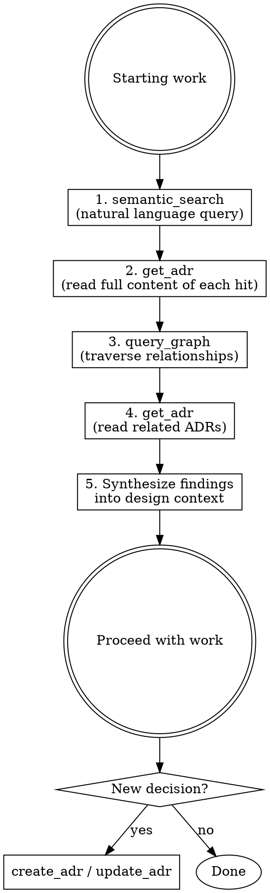

# Using the ADR Plugin (MCP)

## Overview

The obsidian-adr MCP server provides tools to search, read, create, and manage Architecture Decision Records stored in the Obsidian vault. **Always consult existing ADRs before designing anything new** — past decisions contain critical context, constraints, and rationale that must inform current work.

## When to Use

**Before any design or implementation work:**
- Starting a new feature or module
- Changing architecture, dependencies, or conventions
- Making technology choices
- Debugging issues that might relate to past decisions

**After making decisions:**
- Record new architectural decisions as ADRs
- Update existing ADRs when decisions change
- Add relationships between related ADRs

## Core Workflow



### Step 1: Semantic Search

Search for ADRs related to what you're about to work on. Use natural language — describe the domain, problem, or technology.

```
semantic_search({ query: "authentication and session management", project: "parai-core" })
semantic_search({ query: "frontend component library choices", project: "parai-core" })
```

Run multiple searches with different angles if the topic is broad. For example, when working on a new API endpoint, search for "API design", "authentication", and the specific domain ("user profiles").

### Step 2: Read Full ADRs

`list_adrs` and `semantic_search` return summaries only (ID, title, status, date). Read the full content of relevant hits:

```
get_adr({ adr_id: "ADR-012", project: "parai-core" })
```

The full content contains the rationale, context, consequences, and constraints that matter for your design.

### Step 3: Graph Traversal

For each relevant ADR, traverse its relationships to discover connected decisions:

```
query_graph({ adr_id: "ADR-012", project: "parai-core", depth: 2, direction: "both" })
```

This reveals ADRs that `depend_on`, `supersede`, or `relate_to` the one you found. These connected ADRs often contain constraints you wouldn't find via search alone.

### Step 4: Read Related ADRs

Read the full content of any related ADRs discovered through graph traversal that seem relevant to your work.

### Step 5: Synthesize

Combine all findings into design context before proceeding:
- What past decisions constrain the current design?
- What patterns and conventions are established?
- What was tried and rejected (and why)?
- Are any existing ADRs outdated and need updating?

## Recording New Decisions

When you make an architectural decision during implementation:

```
create_adr({
  project: "parai-core",
  title: "Descriptive title of the decision",
  status: "voorgesteld",
  tags: ["relevant", "tags"],
  depends_on: ["ADR-003"],
  relates_to: ["ADR-007"]
})
```

Then use `update_adr` to write the body with context, decision, and consequences.

**Always link new ADRs** to existing related ones using `depends_on`, `relates_to`, or `supersedes`.

## Quick Reference

| Tool | Purpose | Returns |
|------|---------|---------|
| `list_projects` | Discover available projects | Project names and folders |
| `semantic_search` | Find ADRs by meaning | Ranked summaries |
| `list_adrs` | Browse/filter ADRs | Summaries (no body) |
| `get_adr` | Read full ADR content | Complete ADR with body |
| `query_graph` | Traverse relationships | Nodes and edges |
| `create_adr` | Record new decision | New ADR ID and path |
| `update_adr` | Modify title or content | Updated ADR |
| `update_status` | Change ADR status | Updated status |
| `add_relationship` | Link two ADRs | Confirmation |
| `remove_relationship` | Unlink two ADRs | Confirmation |

## Multi-Project

Multiple projects live under `Documentatie/*/ADR`. Pass `project` to scope tools:

```
list_adrs({ project: "Compote" })
list_adrs({ project: "parai-core" })
```

Cross-project references use `Project/ADR-NNN` syntax:

```
add_relationship({ source_id: "ADR-005", project: "Compote", target_id: "parai-core/ADR-003", type: "depends_on" })
```

## Common Mistakes

| Mistake | Fix |
|---------|-----|
| Skipping ADR check before design | Always search first — 2 minutes of research prevents contradicting past decisions |
| Reading only `list_adrs` summaries | Summaries lack rationale — always `get_adr` for full content |
| Searching once with one query | Search from multiple angles — technology, domain, pattern |
| Ignoring graph connections | `query_graph` reveals constraints you won't find via search |
| Creating isolated ADRs | Always add `depends_on` / `relates_to` links to keep the graph connected |
| Forgetting to record decisions | If you chose X over Y for architectural reasons, that's an ADR |
